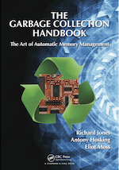
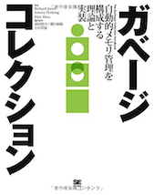

I am a professor of computer science, with academic appointments at [Purdue
University](http://www.cs.purdue.edu/people/hosking) (on leave from August
2015) and the [Australian National
University](http://cs.anu.edu.au/user/3893), contributing also as a researcher
with [NICTA, Australia](http://www.nicta.com.au).  I also consult regularly in
intellectual property litigation as a technical expert.  I studied computer
science at the [University of Adelaide](http://cs.adelaide.edu.au), the
[University of Waikato](http://cs.waikato.ac.nz), and the [University of
Massachusetts at Amherst](http://www.cs.umass.edu), receiving BSc, MSc, and
PhD degrees, respectively.  My research interests lie in the area of
programming language implementation, and I work on problems arising in object
persistence, object databases, distribution, memory management (*garbage
collection*), managed language runtimes, language virtual machines, optimizing
compilers, and architectural support for programming languages and
applications.

I am a Member of the IEEE and Life Member of the [Association for Computing
Machinery](http://www.acm.org), and was named a [Distinguished Scientist of
the ACM](http://awards.acm.org/award_winners/hosking_3211455.cfm) in 2012.

I am co-author of the primary reference work for automatic memory management
[*The Garbage Collection Handbook*](http://gchandbook.org), now translated to
Japanese!

